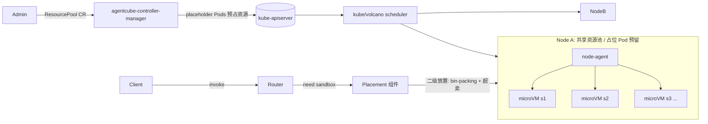
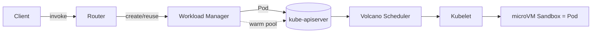
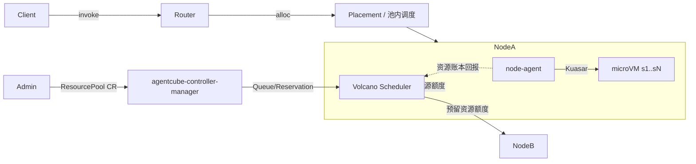

# AgentCube Architecture v2 Proposal

> 本文档采用「多轮迭代」方式打磨。版本治理规则见文末 `## Changelog` 与同目录 `prompt.md`。
> **rev1 范围**：聚焦 *Overall Architecture* 的高层方案选型，给出 A/B/C 三个候选方向与取舍对比。
> **rev2 范围**：①将 Use Cases 改写为用户故事；②**拍板选定方向 B（资源池预占 Pod + 自研二级放置）**；
> ③确认「沙箱不再 Pod 化」，并确立**资源超卖、不 OOM**的核心原则（资源不足时沙箱变慢而非被杀）。
> 仍不下钻 CRD 字段 / HTTP 契约等实现细节，留待后续轮次。

## Motivation

AgentCube v1（见 `../agentcube-proposal.md`）将每个 Agent / CodeInterpreter 会话映射为一个独立的
microVM 沙箱，控制面（Workload Manager）通过 [agent-sandbox](https://github.com/kubernetes-sigs/agent-sandbox)
等 K8s 原语来创建/销毁沙箱。运行一段时间后，我们识别到 v1 在面向 **AI Agent 这类高频、短生命周期、
突发性 workload** 时存在结构性瓶颈：

- **冷启动链路过长**：`Nonexistent → Pending → Running → Ready` 全程要经过
  kube-scheduler 调度决策 → kubelet admit → 拉起 microVM → readiness 探测。每个环节都引入
  百毫秒~秒级延迟，难以满足交互式 Agent 的低延迟诉求。
- **密度受限、控制面压力大**：「1 会话 = 1 Pod」意味着海量短命 Pod 对象涌入 etcd / apiserver /
  scheduler，Watch 风暴与对象 GC 成为规模化瓶颈；单 Node 上能承载的沙箱数被 Pod 模型而非真实资源上限约束。
- **调度与资源分配策略不可定制**：agent-sandbox 过度依赖通用 K8s 调度，缺乏面向「同租户会话亲和、
  GPU 分时复用、warm pool 命中优先、按池 bin-packing」等 Agent 专属诉求的高效调度与高密度装箱能力。
- **资源预留与弹性割裂**：突发流量到来时临时申请资源，受制于集群空闲度与调度排队，无法保证「秒级拿到
  已就绪的算力」。

v2 的目标是**重新设计资源供给与调度模型**，在保留 K8s 作为集群资源底座的前提下，把「会话沙箱的放置与
生命周期」从 kube-scheduler 全链路中解耦，换取**更低的冷启动延迟**与**更高的单 Node 密度**，同时为
Volcano / Kuasar 等生态留出明确的协同接口。

## Goals

- **低冷启动延迟**：常态命中路径（warm / 已预留资源）下，会话从请求到可服务应在亚秒级。
- **高密度**：单 Node 承载的沙箱数由真实资源（CPU/GPU/mem）上限决定，而非 Pod 对象模型上限。
- **可定制的调度策略**：支持面向 Agent 的放置策略（会话亲和、GPU 分时、warm pool 优先、按池装箱）。
- **资源池化与预留**：管理员可声明式划定资源池并预占算力，使突发请求命中「已就绪」资源。
- **与生态清晰协同**：明确与 Volcano（资源预留/配额/Gang）、Kuasar（microVM/多沙箱运行时）的边界与接口。
- **安全隔离不退化**：每会话仍运行在 microVM 级隔离边界内，结束后内存清零、文件系统销毁。

## Non-Goals

- **不重写 LLM / Agent 框架**：v2 仍只做 runtime / infra，不涉及模型与 Agent 编排逻辑。
- **不追求与 v1 的 API/组件兼容**：本轮为全新设计，兼容性放在次要位置，组件可不复用（见 prompt 约束）。
- **不替代通用 K8s workload**：长运行服务 / 经典批处理仍走标准 Deployment / Job。
- **本轮不下钻实现**：rev1 不定义 CRD 字段、HTTP 契约、状态机细节，仅做架构方向选型。
- **暂不做跨集群 / 跨云联邦**：首阶段聚焦单集群内的高效供给。

## Use Cases

> 按用户故事（`作为<角色>，我希望<能力>，以便<价值>`）撰写，并附验收要点，避免空洞。

### US-1：管理员划定并预占资源池
**作为**平台管理员，**我希望**通过一个 CRD（`ResourcePool`）声明式地在集群中圈定一块算力并预占节点资源，
**以便** Agent 工作负载拥有稳定、隔离、可预期的供给，不与其他 K8s 负载相互争抢。
- 验收：创建 `ResourcePool` 后，控制器在目标节点上预占出对应资源；`kubectl` 可见池的容量/已用/可分配。
- 验收：池内资源对普通 Deployment/Job 不可见（不会被通用调度器借用）。

### US-2：开发者获得亚秒级冷启动
**作为** Agent 应用开发者，**我希望**我的 Agent 会话在首个请求到达时能从已预占的资源池中亚秒级拿到沙箱，
**以便**交互式体验不被「调度 → 拉起 microVM」的全链路冷启动拖慢。
- 验收：warm / 资源已就绪命中路径下，P95 会话建立到可服务 < 1s。
- 验收：会话放置是池内本地决策，不经过 kube-scheduler 的逐会话排队。

### US-3：终端用户的会话上下文连续
**作为**通过 Agent 与系统交互的终端用户，**我希望**同一会话的多次调用复用同一个沙箱及其上下文，
**以便**多步任务的中间结果、记忆、工具调用状态被保留。
- 验收：携带相同 `x-agentcube-session-id` 的请求被路由到同一沙箱；会话内文件系统/内存状态保持。

### US-4：过载时优先可用性（超卖、不 OOM）
**作为**平台管理员，**我希望**当某 Node 资源紧张时，该 Node 上的多个沙箱仍能继续运行（仅执行变慢），
而**不是**被 OOM 杀死或驱逐，**以便**突发并发场景下「服务可用」优先于「单沙箱性能」。
- 验收：在内存/CPU 超卖比下注入压力，沙箱进程不被 OOM-kill、不被强杀；表现为延迟升高 / 吞吐下降。
- 验收：压力解除后，沙箱性能自动回升，无需重建。

### US-5：数据科学家的安全代码执行
**作为**使用 notebook 的数据科学家，**我希望**我的代码在 microVM 级隔离的短命沙箱中执行、并在会话结束后被彻底销毁，
**以便**我的数据不泄漏给他人、也不污染或影响其他会话。
- 验收：跨会话无法访问彼此的内存/文件；会话结束后内存清零、文件系统销毁。

### US-6：SRE 对池过载有可预期的兜底行为
**作为**平台 SRE，**我希望**当资源池整体容量耗尽、无法再容纳新沙箱（即便超卖也到达保护阈值）时，
系统按既定策略回落（排队 / 触发集群扩容 / 明确拒绝并返回可重试错误），**以便**过载行为可预期、可告警、可治理。
- 验收：池饱和时新会话得到确定性结果（非随机超时）；有 metrics 暴露池水位与拒绝/排队计数。

### US-7：多租户平台方按池治理配额
**作为**多租户平台方，**我希望**为不同租户/团队分配各自的资源池与配额，
**以便**统一治理算力、镜像、安全策略并支撑计费/限额。
- 验收：租户只能消费授权池的资源；跨租户的沙箱在隔离边界内互不影响。

## Overall Architecture

> rev1 给出 A/B/C 三个候选方向（覆盖「全 K8s 原生 → 全自研二级调度 → 分层混合」谱系）。
> **rev2 已拍板：选定方向 B —— 资源池预占 Pod + 自研二级放置。** 下面先以「选定架构详解」展开 B，
> 再保留 A/B/C 三方向描述与对比表用于决策追溯（A、C 现为被否决/参照项）。

### 共同概念（v2 通用）

- **ResourcePool（资源池）**：管理员通过 CRD 声明一组节点 / 一定额度的 CPU/GPU/mem，作为 Agent 沙箱
  的专属供给域。是 v2 引入的核心新抽象。
- **Sandbox（会话沙箱）**：1 会话 = 1 microVM 隔离实例（沿用 v1 语义）。**v2 决定：沙箱不再 Pod 化**
  （见 DL-2026-06-27-02），由 node-agent 在池内直接拉起 microVM，不产生逐会话的 K8s Pod 对象。
- **Node Agent（节点代理，暂名 PicoD/node-agent）**：运行在 Node 上，负责池内沙箱的本地放置与 microVM
  生命周期管理（拉起/暂停/回收），并维护池内真实资源账本与超卖控制。
- **Router（数据面）**：保持 v1 职责——鉴权、限流、按 `session-id` 路由到沙箱。

### 选定架构详解：方向 B（rev2 拍板）

管理员声明 `ResourcePool` CRD；`agentcube-controller-manager` 调谐它，在目标 Node 上创建一批
**占位 Pod（placeholder/虚拟 Pod，不运行任何容器，仅向 K8s 预占 Node 资源）**——这保证池内资源被 K8s
「圈占」，不会被通用调度器借给其他工作负载。用户创建 Agent 会话时，由 **Placement 组件**在已预占的 Node
集合中做二级放置（bin-packing + 超卖策略），把会话沙箱直接投放到 Node 的共享资源池，由 node-agent 拉起
microVM。**沙箱本身不是 Pod**。

#### 核心原则：资源超卖且不 OOM（rev2 新增，见 DL-2026-06-27-03）

资源池**允许超卖**：当某 Node 的真实资源不足以「满额」供给其上的所有沙箱时，这些沙箱**仍然全部继续运行**，
仅因资源供给不足而**变慢**（更高延迟 / 更低吞吐），但**不会被杀死、不会 OOM、不会被驱逐**。
即「降速优于杀死」（degrade, don't kill）。这是与传统 K8s「超限即 OOMKill / 驱逐」语义的关键差异，也是
本架构面向高密度 Agent 负载的核心取舍。

- **CPU**：竞争只导致排队/降速，天然不致命——倾向用 cgroup 份额（`cpu.weight`）而非硬上限（`cpu.max`）。
- **内存（难点）**：必须避免「超限即 OOMKill」。倾向用软限流 + 兜底（如 `memory.high` + swap/zswap，
  而非 `memory.max` 硬上限），并可叠加 microVM 内存气球（virtio-balloon）在沙箱间动态调剂。
  具体机制有多个备选，见 `Alternatives Considered` 的「超卖不 OOM 机制对比」；详细 cgroup/swap 设计
  留待组件下钻轮。

> 该原则同时约束 **Placement 组件**：它不是按「硬容量」装箱，而是按「超卖比 / 目标水位」放置；只有当
> 池整体到达保护阈值时才触发 US-6 的回落策略（排队 / 扩容 / 拒绝）。

### 候选方向回顾（决策追溯用，A/C 为参照）

#### 方向 A：Pod 原生 + 调度增强（v1/agent-sandbox 模式的演进）— ❌ 未选（对照基线）

保持「1 会话 = 1 Pod（microVM 运行时）」，但通过 **Volcano 调度器 + 大号 warm pool + 镜像/快照预热**
来压低冷启动、提升密度。资源池仅作为调度提示（nodeSelector / quota）。

- **本质**：不改变 K8s 资源模型，靠「调度器替换 + 预热」做增量优化。
- **优点**：最少偏离 K8s 生态；可观测性 / RBAC / 网络策略全部原生可用；实现与维护成本低。
- **缺点**：冷启动仍受 apiserver→scheduler→kubelet 全链路约束；海量短命 Pod 对 etcd/apiserver 的压力
  与密度上限难以根除；warm pool 需要持续占用 Pod 名额，浪费明显。

---

### 方向 B：资源池预占 Pod + 自研二级放置 — ✅ **rev2 选定**

> 详细架构与图示见上文「**选定架构详解：方向 B**」。此处保留要点用于与 A/C 对比。

- **本质**：用占位 Pod 把资源「圈」进来，再用自研二级调度器在池内细粒度放置，绕过 kube-scheduler 的
  逐会话决策；沙箱非 Pod 化；池内允许超卖、不 OOM。
- **优点**：冷启动快（资源已就绪，会话放置是池内本地决策）；密度高（多沙箱共享 Node 池，不产生逐会话
  Pod 对象）；调度策略完全自研可定制。
- **缺点 / 风险（需在后续轮次解决）**：**双重记账**——K8s 视角下资源被占位 Pod「用满」，但真实占用是池内
  动态的，二级调度器须自维护与 kubelet/cgroup 一致的账本，否则资源泄漏；与 kube-scheduler / Volcano
  的资源视图割裂，抢占 / 驱逐 / 配额语义需重新对齐；沙箱非 Pod 化后，原生网络策略 / 日志 / metrics /
  安全上下文都需自建；占位 Pod 空占资源，需要回收策略。
- **为何仍选 B**：在「低延迟 + 高密度 + 调度可定制」上收益最大，契合团队既定方向；其结构性风险（记账、
  超卖不 OOM）改为通过专门设计逐一攻克（见 Open Questions / 后续轮次），而非更换方向。

---

### 方向 C：分层调度——Volcano 做池级预留，node-agent 做池内放置（混合）— ❌ 未选（参照）

在 B 的基础上做关键修正：**上层粗粒度资源预留交给 Volcano**（用其 Queue/Reservation/Gang 能力把
`ResourcePool` 表达为一块被预留的资源，而非一堆占位 Pod），**下层细粒度沙箱放置与 microVM 生命周期交给
node-agent**（基于 Kuasar 的多沙箱 microVM runtime）。沙箱是轻量 CRD（或纯 node-agent 内部对象），
不映射 Pod；node-agent 负责把真实资源账本回报给上层，避免双重记账。

- **本质**：**职责分层**——K8s/Volcano 负责「集群级资源预留与配额」，AgentCube 负责「池内的高密度装箱
  与沙箱生命周期」，两层通过明确接口对账。
- **优点**：兼顾 B 的低延迟 / 高密度，又借 Volcano 缓解双重记账与配额/抢占语义割裂；复用 Kuasar 成熟的
  microVM 多沙箱能力，减少自研运行时成本；与 Volcano / Kuasar 生态形成清晰协同点（也契合 prompt 中
  「需考虑对 Volcano、Kuasar 的诉求」）。
- **缺点 / 风险**：依赖 Volcano 的预留 / 配额能力达到预期（需确认其 Reservation/动态额度是否够用）；
  分层接口（资源账本回报、超卖控制、驱逐协调）是新的设计面，复杂度集中在「两层一致性」上；
  Kuasar 集成带来运行时耦合与版本治理成本。

## API Design

> rev1 不展开。待方向拍板后定义 `ResourcePool` 等 CRD 与 Router/Placement 的 HTTP/gRPC 契约。

## Component Design

> rev1 不展开。三方向涉及的组件集合不同（见 Overall Architecture）。拍板后再分组件下钻：
> Router / agentcube-controller-manager / Placement / node-agent。

## Lifecycle & State Machine

> rev1 不展开（沿用 v1 沙箱状态机思路：Pending→Ready→Paused→Deleted + max TTL，待方向确定后细化）。

## Sequence / Workflow

> rev1 不展开。拍板后补 `sequenceDiagram`：会话请求 → 池内放置 → microVM 拉起 → 路由。

## Alternatives Considered

三个高层方向的统一取舍对比（评分越高越好；★=弱，★★★★★=强）：

| 维度 | 方向 A：Pod 原生+调度增强 | 方向 B：占位 Pod + 自研二级放置 | 方向 C：Volcano 池级预留 + node-agent 池内放置 |
|---|---|---|---|
| 冷启动延迟 | ★★（受全链路约束） | ★★★★★（池内本地决策） | ★★★★★（池内本地决策） |
| 单 Node 密度 | ★★（受 Pod 模型约束） | ★★★★★（共享池、无逐会话 Pod） | ★★★★★（共享池、无逐会话 Pod） |
| 实现/研发复杂度 | ★★★★★（最低） | ★★（需自研调度+账本+非 Pod 化配套） | ★★★（分层接口是主要复杂度） |
| 资源记账一致性 | ★★★★★（K8s 原生单一账本） | ★★（双重记账，超卖/泄漏风险高） | ★★★★（Volcano 预留 + node-agent 对账） |
| 与 Volcano/Kuasar 协同 | ★★★（仅替换调度器） | ★★（自成体系，协同弱） | ★★★★★（明确分层协同点） |
| 可观测性/安全/网络生态 | ★★★★★（全原生） | ★★（沙箱非 Pod，需自建） | ★★★（需自建，但有分层边界托底） |
| 资源浪费（预留空占） | ★★★（warm pool 占名额） | ★★（占位 Pod 空占） | ★★★★（预留为额度而非实体 Pod） |
| 调度策略可定制性 | ★★★（受 Volcano 框架约束） | ★★★★★（完全自研） | ★★★★★（池内完全自研） |

- **A** 是「稳妥但天花板低」的演进路线，适合作为 v2 的对照基线（baseline）。
- **B** 是团队最初设想，**延迟/密度收益最大，但代价是把调度器、资源账本、非 Pod 化的全套配套都自研**，
  双重记账是其最大结构性风险。
- **C** 试图保留 B 的收益、用 Volcano 化解 B 的核心风险，**复杂度从「自研一切」转移到「两层一致性接口」**。

> **rev2 决议**：选定 **方向 B**。理由——B 在低延迟/高密度/调度可定制性上收益最大且最贴合团队既定方向；
> 其结构性风险（双重记账、超卖不 OOM）改为通过专门设计逐项攻克，而非借 C 的分层来回避。C 的「Volcano
> 池级预留 / Kuasar 集成」思路保留为后续可借鉴的优化点（非当前主线）。

### 超卖且不 OOM 的机制对比（rev2 新增，服务于选定方向 B）

「资源不足时沙箱降速而非被杀」的关键在内存维度（CPU 用 `cpu.weight` 份额天然只降速）。备选机制：

| 机制 | 做法 | 优点 | 缺点 / 风险 | 取舍 |
|---|---|---|---|---|
| M0：每沙箱 `memory.max` 硬上限 | cgroup 硬限，超限即 OOMKill | 隔离强、记账简单 | **超限即杀，违反「不 OOM」诉求** | ❌ 否决 |
| M1：`memory.high` 软限 + swap/zswap | 触发回收/限流而非杀进程，swap 兜底 | 不杀进程、压力下自动降速、Linux 原生 | swap thrash 致严重降速；需规划 swap 容量与磁盘 IO | ✅ **初步选定（主）** |
| M2：不设每沙箱内存上限，仅 Node 级管理 | 仅靠 Node 总量 + 大 swap | 实现最简、最大弹性 | 隔离弱、易触发 **Node 级 OOM**（殃及全部沙箱） | ⚠️ 仅作降级兜底 |
| M3：microVM 内存气球（virtio-balloon） | 在沙箱间动态回收/调剂内存 | 弹性最好、可主动从空闲沙箱回收 | 需 Kuasar/cloud-hypervisor 支持 + 控制环路；有回收延迟 | ✅ **作为 M1 的增强** |

> 初步倾向：**M1 为主 + M3 增强**，M2 仅作保护阈值前的最后兜底。**这属于实现机制，rev2 只确立原则与
> 备选**；具体 cgroup v2 / swap / balloon 控制环路设计留待「组件下钻」轮次，并须与「资源账本一致性」
> （Open Questions #4）一并设计。

## Open Questions

1. ~~**方向选型**：A / B / C 选哪个作为 v2 主线？~~ → **rev2 已定：选 B**（DL-2026-06-27-01）。
2. ~~**沙箱是否 Pod 化**~~ → **rev2 已定：沙箱非 Pod**（DL-2026-06-27-02）。遗留：非 Pod 后网络（CNI）、
   日志、metrics、安全上下文、`kubectl` 可见性的替代方案，留待组件下钻轮逐一给出。
3. **超卖不 OOM 机制**：内存维度选 M1（`memory.high`+swap）为主、M3（balloon）增强是否认可？swap 容量/
   介质（本地 NVMe / zswap）如何规划？严重 thrash 时是否需要二级保护（限流入口）？
4. **资源账本一致性**：占位 Pod 让 K8s 视角「满占」，但池内真实占用动态变化且可超卖——node-agent/Placement
   如何维护真实账本，并与 kubelet/cgroup 对账，避免泄漏与误判水位？
5. **Placement 放置语义**：按「超卖比 / 目标水位」放置时，水位指标取什么（实时用量 / 预测 / 工作集）？
   池保护阈值与 US-6 回落策略（排队 / 扩容 / 拒绝）如何联动？
6. **占位 Pod 的形态**：用 `priority`+占位容器、还是 scheduling-only 的 0 容器 Pod、还是 Volcano 预留？
   节点扩缩容时占位 Pod 如何随 `ResourcePool` 调谐？
7. **Kuasar 耦合度**：node-agent 直接基于 Kuasar，还是抽象一层 runtime 接口以便后续替换？
8. **多租户与配额**：`ResourcePool` 与租户/namespace/Quota 的映射关系？跨租户能否共享物理池？

## Decision Log

| 日期 | 决定 | 原因 | 否决/搁置项 |
|---|---|---|---|
| 2026-06-27 | rev1 仅做 Overall Architecture 选型，给出 A/B/C 三方向与对比，不下钻实现 | 遵循 prompt「先选方向再逐层下钻」，降低返工 | 暂不写 CRD/HTTP/状态机细节 |
| 2026-06-27 | 引入 `ResourcePool` 作为 v2 核心新抽象（三方向通用） | v2 的核心是「资源池化 + 预留」以换取低延迟/高密度 | —— |
| 2026-06-27 | **DL-2026-06-27-01**：选定**方向 B**（资源池预占 Pod + 自研二级放置）为 v2 主线 | 低延迟/高密度/调度可定制性收益最大，契合团队既定方向 | 否决 A（天花板低）、C（分层一致性复杂，转为可借鉴优化点） |
| 2026-06-27 | **DL-2026-06-27-02**：**沙箱不再 Pod 化**，由 node-agent 在池内直接拉起 microVM | 消除逐会话 Pod 对象，换取高密度与低控制面压力 | 接受由此带来的网络/日志/metrics/可见性自建成本（遗留 OQ#2） |
| 2026-06-27 | **DL-2026-06-27-03**：确立**超卖、不 OOM**原则（资源不足时沙箱降速而非被杀） | 高密度 Agent 负载下「服务可用」优先于「单沙箱性能」 | 否决 M0（`memory.max` 硬限/OOMKill）；初步选 M1+ M3，M2 仅兜底 |

## Changelog

- **rev1 (2026-06-27)**：首版。聚焦 Overall Architecture，提出 v2 动机（v1 冷启动/密度/调度瓶颈）、
  Goals/Non-Goals/Use Cases，并给出三个高层架构候选方向（A 全 K8s 原生演进 / B 占位 Pod+自研二级放置 /
  C Volcano 池级预留+node-agent 池内放置）及统一取舍对比表。方向未拍板，仅记录初步倾向与 Open Questions。
  实现细节（API/组件/状态机/时序）留待方向选定后逐层下钻。
- **rev2 (2026-06-27)**：① 将 **Use Cases 改写为用户故事**（US-1~US-7，含角色/价值/验收要点）；
  ② **拍板选定方向 B**（资源池预占 Pod + 自研二级放置），新增「选定架构详解」小节，A/C 降为参照；
  ③ 确认 **沙箱非 Pod 化**，并确立 **超卖、不 OOM** 核心原则，新增「超卖不 OOM 机制对比」（M0~M3，
  初选 M1+M3）；④ 相应更新 Decision Log（DL-01/02/03）与 Open Questions（关停方向选型/Pod 化两问，
  新增超卖机制、资源账本、Placement 放置语义、占位 Pod 形态等问题）。未改动 Motivation/Goals/Non-Goals
  及 API/组件/状态机/时序占位章节。
