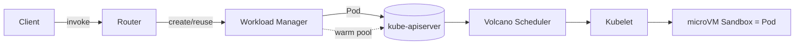
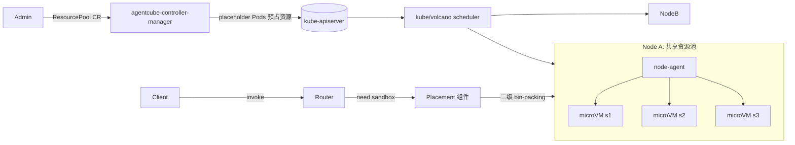
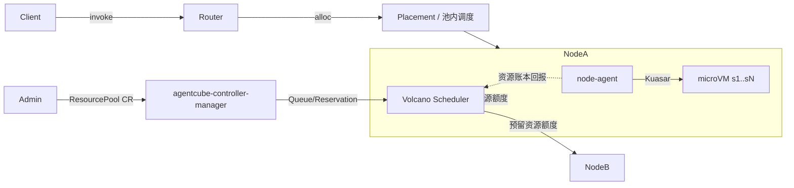

# AgentCube Architecture v2 Proposal

> 本文档采用「多轮迭代」方式打磨。版本治理规则见文末 `## Changelog` 与同目录 `prompt.md`。
> **rev1 范围**：仅聚焦 *Overall Architecture* 的高层方案选型，给出 2~3 个候选方向与取舍对比；
> 不展开 API / 组件 / 实现细节。待方向拍板后再逐层下钻。

## Motivation

AgentCube v1（见 `../agentcube-proposal.md`）将每个 Agent / CodeInterpreter 会话映射为一个独立的
microVM 沙箱，控制面（Workload Manager）通过 [agent-sandbox](https://github.com/kubernetes-sigs/agent-sandbox)
等 K8s 原语来创建/销毁沙箱。运行一段时间后，我们识别到 v1 在面向 **AI Agent 这类高频、短生命周期、
突发性 workload** 时存在结构性瓶颈：

- **冷启动链路过长**：`Nonexistent → Pending → Running → Ready` 全程要经过
  kube-scheduler 调度决策 → kubelet admit → 拉起 microVM → readiness 探测。每个环节都引入
  百毫秒~秒级延迟，难以满足交互式 Agent 的低延迟诉求。
- **密度受限、控制面压力大**：「1 会话 = 1 Pod」意味着海量短命 Pod 对象涌入 etcd / apiserver /
  scheduler，Watch 风暴与对象 GC 成为规模化瓶颈；单 Node 上能承载的沙箱数被 Pod 模型而非真实资源上限约束。
- **调度与资源分配策略不可定制**：agent-sandbox 过度依赖通用 K8s 调度，缺乏面向「同租户会话亲和、
  GPU 分时复用、warm pool 命中优先、按池 bin-packing」等 Agent 专属诉求的高效调度与高密度装箱能力。
- **资源预留与弹性割裂**：突发流量到来时临时申请资源，受制于集群空闲度与调度排队，无法保证「秒级拿到
  已就绪的算力」。

v2 的目标是**重新设计资源供给与调度模型**，在保留 K8s 作为集群资源底座的前提下，把「会话沙箱的放置与
生命周期」从 kube-scheduler 全链路中解耦，换取**更低的冷启动延迟**与**更高的单 Node 密度**，同时为
Volcano / Kuasar 等生态留出明确的协同接口。

## Goals

- **低冷启动延迟**：常态命中路径（warm / 已预留资源）下，会话从请求到可服务应在亚秒级。
- **高密度**：单 Node 承载的沙箱数由真实资源（CPU/GPU/mem）上限决定，而非 Pod 对象模型上限。
- **可定制的调度策略**：支持面向 Agent 的放置策略（会话亲和、GPU 分时、warm pool 优先、按池装箱）。
- **资源池化与预留**：管理员可声明式划定资源池并预占算力，使突发请求命中「已就绪」资源。
- **与生态清晰协同**：明确与 Volcano（资源预留/配额/Gang）、Kuasar（microVM/多沙箱运行时）的边界与接口。
- **安全隔离不退化**：每会话仍运行在 microVM 级隔离边界内，结束后内存清零、文件系统销毁。

## Non-Goals

- **不重写 LLM / Agent 框架**：v2 仍只做 runtime / infra，不涉及模型与 Agent 编排逻辑。
- **不追求与 v1 的 API/组件兼容**：本轮为全新设计，兼容性放在次要位置，组件可不复用（见 prompt 约束）。
- **不替代通用 K8s workload**：长运行服务 / 经典批处理仍走标准 Deployment / Job。
- **本轮不下钻实现**：rev1 不定义 CRD 字段、HTTP 契约、状态机细节，仅做架构方向选型。
- **暂不做跨集群 / 跨云联邦**：首阶段聚焦单集群内的高效供给。

## Use Cases

1. **交互式 Agent，亚秒级启动**：会话请求到达即从资源池命中已就绪沙箱，避免全链路调度。
2. **安全的代码解释器会话**：notebook / "Run code" 场景，短命、强隔离、严格资源上限。
3. **GPU 高密度分时复用**：多个轻量 Agent 会话共享同一 Node 的 GPU 资源池，按需分时。
4. **多租户 AI 平台**：平台方按租户/团队划定资源池与配额，统一治理镜像、策略、quota。
5. **突发流量弹性**：通过预占资源 + warm pool 吸收尖峰，超出池容量时再回落到集群级扩容。

## Overall Architecture

> 本轮核心产出。下面给出三个候选方向，覆盖「全 K8s 原生 → 全自研二级调度 → 分层混合」的谱系，
> 并在 `Alternatives Considered` 给出统一对比表。**方向未拍板**，故 `Decision Log` 仅记录本轮的
> 取舍框架，不预设结论。

### 共同概念（三方向通用）

- **ResourcePool（资源池）**：管理员通过 CRD 声明一组节点 / 一定额度的 CPU/GPU/mem，作为 Agent 沙箱
  的专属供给域。是 v2 引入的核心新抽象。
- **Sandbox（会话沙箱）**：1 会话 = 1 microVM 隔离实例（沿用 v1 语义）。差别在于「沙箱如何被放置与
  承载」——是否仍是 Pod。
- **Node Agent（节点代理，暂名 PicoD/node-agent）**：运行在 Node 上，负责池内沙箱的本地放置与 microVM
  生命周期管理（拉起/暂停/回收）。
- **Router（数据面）**：保持 v1 职责——鉴权、限流、按 `session-id` 路由到沙箱。

---

### 方向 A：Pod 原生 + 调度增强（v1/agent-sandbox 模式的演进）

保持「1 会话 = 1 Pod（microVM 运行时）」，但通过 **Volcano 调度器 + 大号 warm pool + 镜像/快照预热**
来压低冷启动、提升密度。资源池仅作为调度提示（nodeSelector / quota）。

- **本质**：不改变 K8s 资源模型，靠「调度器替换 + 预热」做增量优化。
- **优点**：最少偏离 K8s 生态；可观测性 / RBAC / 网络策略全部原生可用；实现与维护成本低。
- **缺点**：冷启动仍受 apiserver→scheduler→kubelet 全链路约束；海量短命 Pod 对 etcd/apiserver 的压力
  与密度上限难以根除；warm pool 需要持续占用 Pod 名额，浪费明显。

---

### 方向 B：资源池预占 Pod + 自研二级放置（团队提出的新方向）

管理员声明 `ResourcePool` CRD；`agentcube-controller-manager` 调谐它，在目标 Node 上创建一批
**占位 Pod（placeholder/虚拟 Pod，不运行任何容器，仅向 K8s 预占 Node 资源）**。用户创建 Agent 时，由
**Placement 组件**在已预占的 Node 集合中做二级调度（bin-packing），把会话沙箱直接投放到 Node 的共享
资源池，由 node-agent 在占位 Pod 预留出的资源内拉起 microVM。**沙箱本身不再是独立 Pod**。

- **本质**：用占位 Pod 把资源「圈」进来，再用自研二级调度器在池内细粒度放置，绕过 kube-scheduler 的
  逐会话决策。
- **优点**：冷启动快（资源已就绪，会话放置是池内本地决策）；密度高（多沙箱共享 Node 池，不产生逐会话
  Pod 对象）；调度策略完全自研可定制。
- **缺点 / 风险**：**双重记账**——K8s 视角下资源被占位 Pod「用满」，但真实占用是池内动态的，二级调度器
  必须自己维护一套与 kubelet/cgroup 一致的账本，否则会超卖或资源泄漏；与 kube-scheduler / Volcano
  的资源视图割裂，抢占 / 驱逐 / 配额语义需重新对齐；沙箱非 Pod 化后，原生网络策略 / 日志 / metrics /
  安全上下文都需自建；占位 Pod 空占资源，需要 overcommit 与回收策略。

---

### 方向 C：分层调度——Volcano 做池级预留，node-agent 做池内放置（混合）

在 B 的基础上做关键修正：**上层粗粒度资源预留交给 Volcano**（用其 Queue/Reservation/Gang 能力把
`ResourcePool` 表达为一块被预留的资源，而非一堆占位 Pod），**下层细粒度沙箱放置与 microVM 生命周期交给
node-agent**（基于 Kuasar 的多沙箱 microVM runtime）。沙箱是轻量 CRD（或纯 node-agent 内部对象），
不映射 Pod；node-agent 负责把真实资源账本回报给上层，避免双重记账。

- **本质**：**职责分层**——K8s/Volcano 负责「集群级资源预留与配额」，AgentCube 负责「池内的高密度装箱
  与沙箱生命周期」，两层通过明确接口对账。
- **优点**：兼顾 B 的低延迟 / 高密度，又借 Volcano 缓解双重记账与配额/抢占语义割裂；复用 Kuasar 成熟的
  microVM 多沙箱能力，减少自研运行时成本；与 Volcano / Kuasar 生态形成清晰协同点（也契合 prompt 中
  「需考虑对 Volcano、Kuasar 的诉求」）。
- **缺点 / 风险**：依赖 Volcano 的预留 / 配额能力达到预期（需确认其 Reservation/动态额度是否够用）；
  分层接口（资源账本回报、超卖控制、驱逐协调）是新的设计面，复杂度集中在「两层一致性」上；
  Kuasar 集成带来运行时耦合与版本治理成本。

## API Design

> rev1 不展开。待方向拍板后定义 `ResourcePool` 等 CRD 与 Router/Placement 的 HTTP/gRPC 契约。

## Component Design

> rev1 不展开。三方向涉及的组件集合不同（见 Overall Architecture）。拍板后再分组件下钻：
> Router / agentcube-controller-manager / Placement / node-agent。

## Lifecycle & State Machine

> rev1 不展开（沿用 v1 沙箱状态机思路：Pending→Ready→Paused→Deleted + max TTL，待方向确定后细化）。

## Sequence / Workflow

> rev1 不展开。拍板后补 `sequenceDiagram`：会话请求 → 池内放置 → microVM 拉起 → 路由。

## Alternatives Considered

三个高层方向的统一取舍对比（评分越高越好；★=弱，★★★★★=强）：

| 维度 | 方向 A：Pod 原生+调度增强 | 方向 B：占位 Pod + 自研二级放置 | 方向 C：Volcano 池级预留 + node-agent 池内放置 |
|---|---|---|---|
| 冷启动延迟 | ★★（受全链路约束） | ★★★★★（池内本地决策） | ★★★★★（池内本地决策） |
| 单 Node 密度 | ★★（受 Pod 模型约束） | ★★★★★（共享池、无逐会话 Pod） | ★★★★★（共享池、无逐会话 Pod） |
| 实现/研发复杂度 | ★★★★★（最低） | ★★（需自研调度+账本+非 Pod 化配套） | ★★★（分层接口是主要复杂度） |
| 资源记账一致性 | ★★★★★（K8s 原生单一账本） | ★★（双重记账，超卖/泄漏风险高） | ★★★★（Volcano 预留 + node-agent 对账） |
| 与 Volcano/Kuasar 协同 | ★★★（仅替换调度器） | ★★（自成体系，协同弱） | ★★★★★（明确分层协同点） |
| 可观测性/安全/网络生态 | ★★★★★（全原生） | ★★（沙箱非 Pod，需自建） | ★★★（需自建，但有分层边界托底） |
| 资源浪费（预留空占） | ★★★（warm pool 占名额） | ★★（占位 Pod 空占） | ★★★★（预留为额度而非实体 Pod） |
| 调度策略可定制性 | ★★★（受 Volcano 框架约束） | ★★★★★（完全自研） | ★★★★★（池内完全自研） |

- **A** 是「稳妥但天花板低」的演进路线，适合作为 v2 的对照基线（baseline）。
- **B** 是团队最初设想，**延迟/密度收益最大，但代价是把调度器、资源账本、非 Pod 化的全套配套都自研**，
  双重记账是其最大结构性风险。
- **C** 试图保留 B 的收益、用 Volcano 化解 B 的核心风险，**复杂度从「自研一切」转移到「两层一致性接口」**。

> 初步倾向：**C 作为主攻方向、A 作为对照基线、B 作为 C 的退化参照**——但本轮不拍板，等你裁决。

## Open Questions

1. **方向选型**：A / B / C 选哪个作为 v2 主线？是否接受「C 为主、A 为基线」的初步倾向？
2. **Volcano 能力边界**：Volcano 现有的 Queue / Reservation / 动态配额，能否表达「预留一块资源池且不
   产生逐会话 Pod」的语义？需要对 Volcano 提出哪些新诉求？
3. **沙箱是否 Pod 化**：B/C 倾向「沙箱非 Pod」。一旦非 Pod，网络（CNI）、日志、metrics、安全上下文、
   `kubectl` 可见性如何提供？是否接受这些原生能力的损失或自建成本？
4. **资源账本一致性**：池内真实占用如何与上层（kubelet/cgroup/Volcano）对账，避免超卖与泄漏？
5. **Kuasar 耦合度**：node-agent 直接基于 Kuasar，还是抽象一层 runtime 接口以便后续替换？
6. **多租户与配额**：`ResourcePool` 与租户/namespace/Quota 的映射关系？跨租户能否共享物理池？

## Decision Log

| 日期 | 决定 | 原因 | 否决/搁置项 |
|---|---|---|---|
| 2026-06-27 | rev1 仅做 Overall Architecture 选型，给出 A/B/C 三方向与对比，不下钻实现 | 遵循 prompt「先选方向再逐层下钻」，降低返工 | 暂不写 CRD/HTTP/状态机细节 |
| 2026-06-27 | 引入 `ResourcePool` 作为 v2 核心新抽象（三方向通用） | v2 的核心是「资源池化 + 预留」以换取低延迟/高密度 | —— |
| 2026-06-27 | 主线方向**暂不拍板**，仅记录初步倾向（C 为主、A 为基线、B 为参照） | 选型涉及与 Volcano/Kuasar 的外部依赖确认，需团队裁决 | —— |

## Changelog

- **rev1 (2026-06-27)**：首版。聚焦 Overall Architecture，提出 v2 动机（v1 冷启动/密度/调度瓶颈）、
  Goals/Non-Goals/Use Cases，并给出三个高层架构候选方向（A 全 K8s 原生演进 / B 占位 Pod+自研二级放置 /
  C Volcano 池级预留+node-agent 池内放置）及统一取舍对比表。方向未拍板，仅记录初步倾向与 Open Questions。
  实现细节（API/组件/状态机/时序）留待方向选定后逐层下钻。
